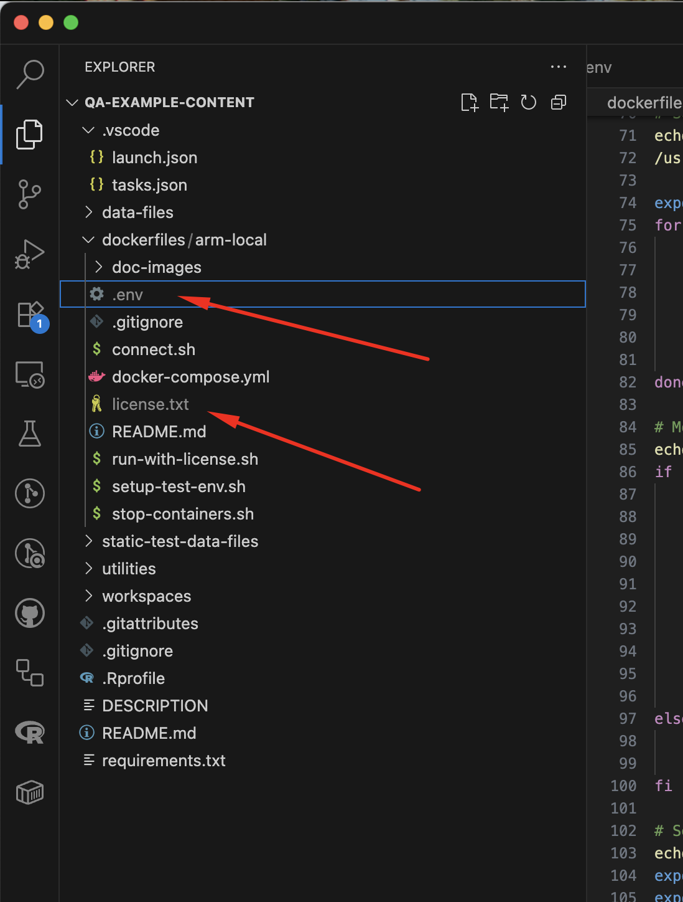

# Setup for Positron ARM64 Local Testing

Create the following files in the `dockerfiles/arm-local` directory:



In the .env file, set the following variables:

```bash
E2E_POSTGRES_USER=
E2E_POSTGRES_PASSWORD=
E2E_POSTGRES_DB=
```
(the values to use are in 1Password under Positron > E2E Postgres DB Connection info)

In the license.txt file, add the Positron Workbench License from the 1Password IDE/Workbench vault.

# Execution

You will need two terminal windows open to dockerfiles/arm-local for this process.  

In the first terminal, run:

```bash
docker login ghcr.io -u <github_username>
```
(as your password, use a GitHub Personal Access Token with the `read:packages` scope).

Then run:

```bash
./run-with-license.sh ubuntu24
OR
./run-with-license.sh rocky8
```
(depending on which OS you want to test with - both are supported).

This will start the containers and keep them alive.

In the second terminal, run:

```bash
./connect.sh
```

Then inside the container, run:

```bash
/tmp/setup-test-env.sh <branch_name>
cd /__w/positron/positron
source ~/.bashrc
```
(Note that the /__w/positron/positron path is where the Positron code is located inside the container inside CI and we are matching that here).

At this point you will be ready to run tests. Here are a couple sample command lines:

```bash
npx playwright test --project e2e-electron --workers 2 --grep @:connections --retries 1 --max-failures 10
npx playwright test --project e2e-browser --workers 2 --grep @:data-explorer --retries 1 --max-failures 10
```
Note that if tests fail, playwright will try to show you the report, but it needs to be on host 0.0.0.0, so CTRL-C out of the default report process and see `View Report on Host` below.

When you are done, you can run (in the second terminal):

```bash
exit
```

Then go back to the first and use CTRL-C.  Optionally, you can then run:

```bash
 ./stop-containers.sh ubuntu24
 OR
 ./stop-containers.sh rocky8
 ```
 (if you don't want to leave the containers running).  This will reset your environment for next time.

 # View Report on Host
Run:
```bash
npx playwright show-report --host 0.0.0.0
```
Then go to http://localhost:9323 in your host browser to view the test report.

# View Running Tests via VNC - Ubuntu 24 Only

Inside the container, run:
```bash
fluxbox &
sudo x11vnc -forever -nopw -display :10 &
```
(note that these commands are run in the background so it may look like you didn't get your prompt back, so just hit Enter).

Then use a VNC viewer to connect to localhost:5900 on your host machine.
(RealVNC Viewer is a good free option)

# View Running Tests via VNC - Rocky 8 Only

Inside the container, run:
```bash
x0vncserver -display :10 -SecurityTypes None -rfbport 5900 -AlwaysShared &
```
(note that this command is run in the background so it may look like you didn't get your prompt back, so just hit Enter).

Then use a VNC viewer to connect to localhost:5900 on your host machine.
(RealVNC Viewer is a good free option)

# Code Changes and Retesting

If you make code changes and want to retest, push your changes from your local machine to github, then inside the container run:

```bash
git pull
npm run compile
```

Then rerun your tests, unless you also changed tests, in which case also run:

```bash
npm --prefix test/e2e run compile
```

If you happen to have added dependencies, you can run:

```bash
npm run ci
```

## Warnings

The file test/e2e/fixtures/settings.json will be updated by test runs. Please do not commit this file.

# Running Positron By Itself (no E2E Tests)

In the `/__w/positron/positron` directory inside the container, run:
```bash
./scripts/code.sh --no-sandbox
```

Then access Positron via VNC as described above.

# Connecting via SSH

## Ubuntu 24
Inside the container, run:
```bash
apt-get install -y openssh-server
mkdir -p /var/run/sshd
echo 'root:root' | chpasswd
sed -i 's/#PermitRootLogin prohibit-password/PermitRootLogin yes/' /etc/ssh/sshd_config
service ssh restart
```

## Rocky 8
```
yum install -y openssh-server
mkdir -p /var/run/sshd
echo 'root:root' | chpasswd
sed -i 's/^#\?PermitRootLogin.*/PermitRootLogin yes/' /etc/ssh/sshd_config
sed -i 's/^#\?PasswordAuthentication.*/PasswordAuthentication yes/' /etc/ssh/sshd_config
ssh-keygen -A
/usr/sbin/sshd
```

On your host machine, edit your SSH config file (usually `~/.ssh/config`) to add the following:

```
Host docker
  HostName 127.0.0.1
  Port 3456
  User root
  UserKnownHostsFile /tmp/known_hosts
  StrictHostKeyChecking yes
```

Then run:
```bash
ssh-keyscan -p 3456 127.0.0.1 >> /tmp/known_hosts
```

Then connect to `docker` from VS Code (by clicking the very left bottom most part of the VSCode IDE). Note that the password is `root`. You should then be able to modify the code easily. Refer to the Code Changes and Retesting section above for rebuilding notes (the watchers are not running in the container).