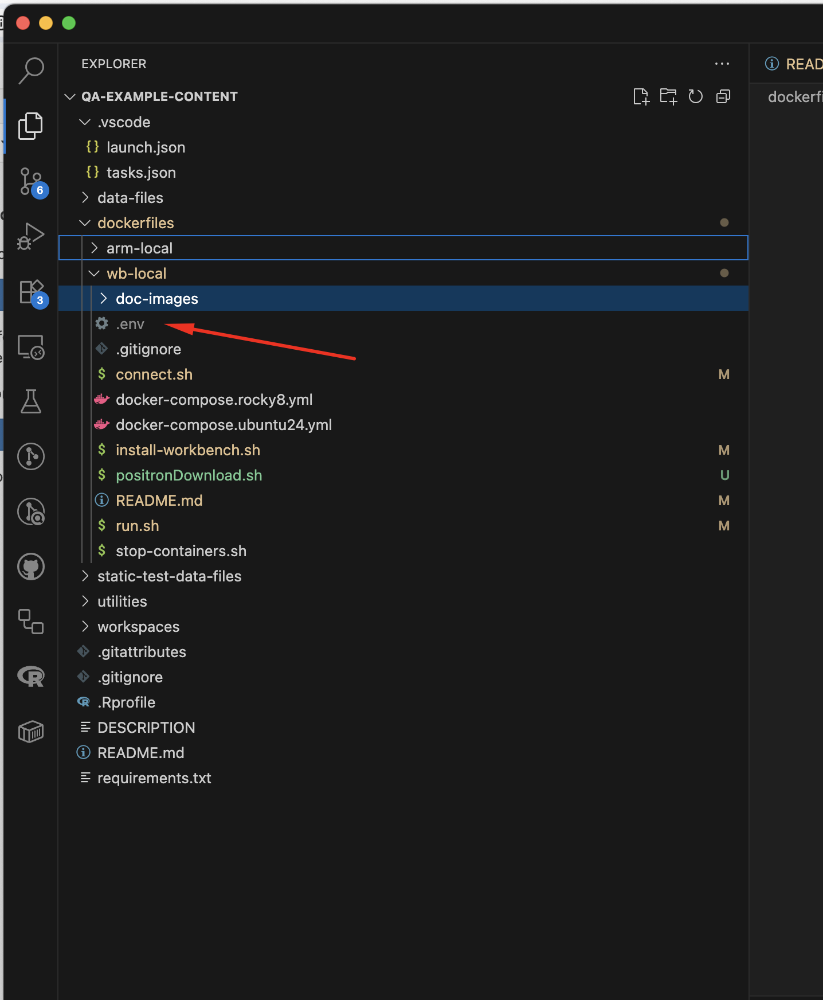

# Setup for Positron ARM64 Local Testing

Create the following file in the `dockerfiles/wb-local` directory:



In this .env file, set the following variables:

```bash
E2E_POSTGRES_USER=
E2E_POSTGRES_PASSWORD=
E2E_POSTGRES_DB=
Q_PASSWORD=

```
* The values to use for the E2E_POSTGRES vars are in 1Password under Positron > E2E Postgres DB Connection info
* The Q_PASSWORD value is the password you would like to be set for the user `user1` in Workbench

# Execution

You will need two terminal windows open to dockerfiles/wb-local for this process.  

In the first terminal, run:

```bash
docker login ghcr.io -u <github_username>
```
(as your password, use a GitHub Personal Access Token with the `read:packages` scope).

Then run:

```bash
./run.sh ubuntu24
```

This will start the containers and keep them alive.

In the second terminal, run:

```bash
./connect.sh
```

Then inside the container, run:

```bash
GITHUB_TOKEN={your token} /tmp/install-workbench.sh
OR
WB_URL=https://s3.amazonaws.com/rstudio-ide-build/server/jammy/arm64/rstudio-workbench-2025.11.0-daily-131.pro5-arm64.deb POSITRON_TAG=2025.10.0-88 GITHUB_TOKEN={your token} /tmp/install-workbench.sh

```
* Note that WB_URL can be set to whichever Workbench deb you want to test with, or it can be omitted to use the default version in the script.
* Note that POSITRON_TAG can be set to whichever Positron tag you want to test with, or it can be omitted to use the default version in the script.

At this point you will be ready to launch Workbench and log in with user1 and the password you set in the .env file. Go to http://localhost:8787 in your browser to access Workbench.


Terminal One
./run.sh ubuntu24

Terminal Two
./connect.sh

Example commands:
WB_URL=https://s3.amazonaws.com/rstudio-ide-build/server/jammy/arm64/rstudio-workbench-2025.11.0-daily-131.pro5-arm64.deb POSITRON_TAG=2025.10.0-88 GITHUB_TOKEN={your token} /tmp/install-workbench.sh

GITHUB_TOKEN={your token} /tmp/install-workbench.sh