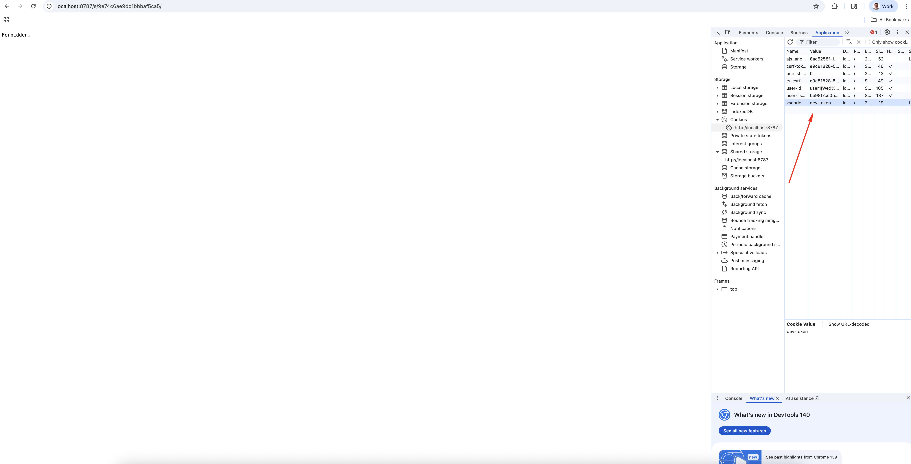

# Setup for Positron ARM64 Local Workbench Testing

## Prerequisites

Create a `.env` file in the `dockerfiles/wb-local` directory with these variables:

```bash
E2E_POSTGRES_USER=
E2E_POSTGRES_PASSWORD=
E2E_POSTGRES_DB=
WB_PASSWORD=
```

**Where to find values:**
* **E2E_POSTGRES vars**: 1Password under `Positron > E2E Postgres DB Connection info`  
* **WB_PASSWORD**: Your desired password for the `user1` account in Workbench
* **GitHub Token**: Personal Access Token with `read:packages` scope

## Installation

Open **two terminal windows** in the `dockerfiles/wb-local` directory:

### Terminal 1: Start Docker Containers

```bash
docker login ghcr.io -u <your_github_username>
./run.sh ubuntu24
```

**What this does:**
1. **Docker login** - Authenticates with GitHub's container registry to download the test images
2. **./run.sh ubuntu24** - Starts Ubuntu 24 containers that include:
   - A clean Ubuntu environment for testing
   - Pre-installed development tools and dependencies
   - Database services (PostgreSQL) for Workbench
   - Network configuration to access via localhost:8787

### Terminal 2: Connect & Install

```bash
GITHUB_TOKEN=your_personal_access_token_here ./connect.sh
```

**What this does:**
1. **Connects** to the running Ubuntu container
2. **Copies** installation scripts into the container  
3. **Automatically runs** the installation script, which will prompt:
   1. Latest versions
   2. Specific versions -  *enter custom URLs/tags when prompted*
   3. **Skip installation**  - *connect only for inspection/debugging*

**For CI/Automated Usage:**
```bash
GITHUB_TOKEN=your_token ./connect.sh --ci
```
This bypasses all prompts and automatically installs the latest versions.

### Access Workbench

Open <http://localhost:8787> and login:
* **Username**: `user1`
* **Password**: Your `.env` WB_PASSWORD value

## Cleanup

**When finished:**
1. Terminal 2: `exit`
2. Terminal 1: Press `Ctrl+C`
3. Optional: `./stop-containers.sh ubuntu24` (resets environment)

## Troubleshooting

### Getting Forbidden Error

You will need to delete the cookie for vscode-tkn for <http://localhost>. See the image below:



Refresh the page and you should be logged in.